# Introduction to the gem5 emulator

This report is part of the assignment for the course *Computer Architecture and Accelerators* at the *Aristotle University of Thessaloniki*. The purpose of this assignment is to provide an introduction to the gem5 simulator, a widely used tool in computer architecture research.

## Part 1 - Introduction to gem5 and Hello World

### Question 1

The [starter_se.py](./hello-world/starter_se.py) script configures a system for **syscall emulation (SE) mode** in gem5, where user-level applications are executed without a full operating system. The main parameters of the simulated system are summarized below.

#### **CPU Configuration**

- **CPU Model**: `MinorCPU`
- **Number of cores**: 1 (default value of `--num-cores`)
- **CPU frequency**: 1 GHz (default value of `--cpu-freq`)
- **Voltage**: 1.2 V

The CPU is created as part of a `CpuCluster`, which allows support for multi-core configurations, although only one core is used in this example.

#### **Cache hierarchy**

The cache hierarchy is enabled because the `MinorCPU` model operates in timing memory mode, which allows detailed modeling of cache and memory access latencies.

- **Cache line size**: 64 bytes
- **L1 Instruction Cache (L1I)**: enabled
- **L1 Data Cache (L1D)**: enabled
- **L2 Cache**: enabled and shared across the CPU cluster
- **TLB walk cache**: enabled

#### **Memory system**

- **Main memory type**: `DDR3_1600_8x8` (default value of `--mem-type`)
- **Memory size**: 2 GB (default value of `--mem-size`)
- **Memory channels**: 2 (default value of `--mem-channels`)
- **Memory bus**: SystemXBar (system crossbar interconnect)

The main memory is configured using the `MemConfig.config_mem()` helper function, which instantiates the selected DRAM model, connects it to the system bus, and maps it into the system’s physical address space.

#### **Clock and voltage**

- **System clock**: 1 GHz
- **System voltage**: 3.3 V

### Question 2

**a)** The [config.ini](./hello-world/config.ini) file generated by gem5 provides a detailed representation of the simulated system. By inspecting this file, we can verify the parameters identified in the previous question.

#### **CPU Configuration**

- **CPU Model**: [`system > cpu_cluster > cpus > type`](./hello-world/config.ini#L67)
- **Number of cores**: [`system > cpu_cluster > cpus`](./hello-world/config.ini#L66) (the list contains 1 object)
- **CPU frequency**: [`system > cpu_cluster > clk_domain > clock`](./hello-world/config.ini#L60)
- **Voltage**: [`system > cpu_cluster > voltage_domain > voltage`](./hello-world/config.ini#L1226)

#### **Cache hierarchy**

- **Cache line size**: [`system > cache_line_size`](./hello-world/config.ini#L15)
- **L1 Instruction Cache (L1I)**: [`system > cpu_cluster > cpus > icache`](./hello-world/config.ini#L871)
- **L1 Data Cache (L1D)**: [`system > cpu_cluster > cpus > dcache`](./hello-world/config.ini#L169)
- **L2 Cache**: [`system > cpu_cluster > l2`](./hello-world/config.ini#L1123)
- **TLB walk cache**: [`system > cpu_cluster > cpus > itb_walker_cache`](./hello-world/config.ini#L1026)

#### **Memory system**

- **Main memory type**: [`system > mem_ctrls > type`](./hello-world/config.ini#L1237)
- **Memory size**: [`system > mem_ranges`](./hello-world/config.ini#L25) (range from 0 to 2,147,483,647)
- **Memory channels**: [`system > memories`](./hello-world/config.ini#L26) (**2 memory controllers** in the list, each one manage a channel of RAM)
- **Memory bus**: [`system > membus > type`](./hello-world/config.ini#L1419)

#### **Clock and voltage**

- **System clock**: [`system > clk_domain > clock`](./hello-world/config.ini#L46)
- **System voltage**: [`system > voltage_domain > voltage`](./hello-world/config.ini#L1453)

**b)** The [stats.txt](./hello-world/stats.txt) file contains several metrics that describe the execution of the simulation.

- **sim_seconds**: Represents the total execution time of the program on the simulated system, measured in seconds. For the `hello-world` program, this is 0.000035 sec.
- **sim_ticks**: Indicates the total number of simulation ticks elapsed during execution. In gem5, one tick corresponds to one picosecond. For `hello-world` program, this is 35,452,000 ticks.
- **sim_insts**: The total number of instructions executed by the simulated CPU during the simulation. For `hello-world` program, this is 5,043 instructions.
- **host_inst_rate**: Describes the rate at which instructions are simulated on the host machine, reflecting the speed of the simulation rather than the performance of the simulated architecture. For `hello-world` program, this is 213,437 instruction per second.

**d)** In [stats.txt](./hello-world/stats.txt), the total number of cache accesses can be found at:  

- **L1 Data Cache:** [`system.cpu_cluster.cpus.dcache.overall_accesses::total`](./hello-world/stats.txt#L1114)  
- **L2 Cache:** [`system.cpu_cluster.l2.overall_accesses::total`](./hello-world/stats.txt#L846)  

For the `hello-world` program, the values are:  

- **L1 Data Cache accesses:** 2,185  
- **L2 Cache accesses:** 475  

If the total number of accesses is not directly reported, it can be calculated using the number of hits and misses:  

$$
\text{Total Accesses} = \text{Hits} + \text{Misses}
$$

**Examples:**  

- **L1 D-Cache:**  
  - Hits: 2,006 ([`system.cpu_cluster.cpus.dcache.overall_hits::total`](./hello-world/stats.txt#L1102))  
  - Misses: 179 ([`system.cpu_cluster.cpus.dcache.overall_misses::total`](./hello-world/stats.txt#L1106)) 

- **L2 Cache:**  
  - Hits: 0
  - Misses: 475 ([`system.cpu_cluster.l2.overall_misses::total`](./hello-world/stats.txt#L834))

### Question 3

**In-order** processors execute instructions strictly in the sequential order defined by the compiled program, meaning the CPU must stall and wait if an instruction encounters a delay. In contrast, **out-of-order** processors can identify independent instructions and execute them ahead of stalled ones, reordering the workflow to hide latencies. The in-order processor models in gem5 are the following:

#### **AtomicSimpleCPU**

The **AtomicSimpleCPU** is the most basic model in gem5, designed primarily for extremely fast simulation speeds (e.g., for booting an operating system) rather than architectural accuracy. It uses **atomic memory accesses**, which means that memory requests are completed instantaneously in a single function call. The simulator calculates an approximate latency for the operation, but no simulation time actually passes during the access, and resource contention (such as a busy memory bus) is completely ignored.

#### **TimingSimpleCPU**

The **TimingSimpleCPU** is a non-pipelined model that serves as a middle ground, offering better accuracy than the atomic model by simulating the timing of memory interactions. It uses **timing memory accesses**, where memory requests are treated as realistic transactions that must travel through the cache hierarchy and interconnects. The CPU actually pauses execution until the memory system sends a response, and the simulator accurately models delays caused by resource contention, queues, and cache misses.

#### **MinorCPU**

The **MinorCPU** is a detailed, in-order processor model that is significantly more accurate than the SimpleCPU models because it simulates a fixed **4-stage pipeline** and uses **timing memory accesses**. It accounts for pipeline hazards, bubbles, and data dependencies. The four stages of the pipeline function as follows:

- **Fetch1**: Fetches lines of data from the instruction cache.
- **Fetch2**: Breaks those lines into individual instructions and performs branch prediction.
- **Decode**: Decodes the instructions into micro-operations and prepares them for execution.
- **Execute**: Performs the arithmetic (ALU) operations, accesses memory (Load/Store), and commits the results to the architectural state.

**a)** The program [sum-1-t-n.c](./sum-1-to-n/sum-1-to-n.c) was executed in gem5 in syscall emulation mode with the same system parameters, but using two different CPU models:  **TimingSimpleCPU** and **MinorCPU**.

From the `stats.txt` files ([TimingSimpleCPU](./sum-1-to-n/TimingSimpleCPU/2GHz-DDR3_1600_8x8/stats.txt), [MinorCPU](./sum-1-to-n/MinorCPU/2GHz-DDR3_1600_8x8/stats.txt)) we obtain the following key simulation metrics:

#### **TimingSimpleCPU**

- [`sim_insts`](./sum-1-to-n/TimingSimpleCPU/2GHz-DDR3_1600_8x8/stats.txt#L10) = 23,789
- [`sim_ticks`](./sum-1-to-n/TimingSimpleCPU/2GHz-DDR3_1600_8x8/stats.txt#L13) = 1,834,846,000
- [`sim_seconds`](./sum-1-to-n/TimingSimpleCPU/2GHz-DDR3_1600_8x8/stats.txt#L12) = 0.001835
- [`system.cpu.numCycles`](./sum-1-to-n/TimingSimpleCPU/2GHz-DDR3_1600_8x8/stats.txt#L135) = 3,669,692
- [`system.cpu.num_idle_cycles`](./sum-1-to-n/TimingSimpleCPU/2GHz-DDR3_1600_8x8/stats.txt#L147) = 0.002000

#### **MinorCPU**

- [`sim_insts`](./sum-1-to-n/MinorCPU/2GHz-DDR3_1600_8x8/stats.txt#L10) = 23,845
- [`sim_ticks`](./sum-1-to-n/MinorCPU/2GHz-DDR3_1600_8x8/stats.txt#L13) = 46,192,000
- [`sim_seconds`](./sum-1-to-n/MinorCPU/2GHz-DDR3_1600_8x8/stats.txt#L12) = 0.000046
- [`system.cpu.numCycles`](./sum-1-to-n/MinorCPU/2GHz-DDR3_1600_8x8/stats.txt#L155) = 92,384
- [`system.cpu.ipc`](./sum-1-to-n/MinorCPU/2GHz-DDR3_1600_8x8/stats.txt#L96) = 0.258107
- [`system.cpu.cpi`](./sum-1-to-n/MinorCPU/2GHz-DDR3_1600_8x8/stats.txt#L29) = 3.874355
- [`system.cpu.idleCycles`](./sum-1-to-n/MinorCPU/2GHz-DDR3_1600_8x8/stats.txt#L95) = 58,013

We observe that, although the program executes approximately the same number of instructions on both models, the total simulation time (in ticks/seconds) is significantly smaller for MinorCPU compared to TimingSimpleCPU.

**b)** The measurements in the `stats.txt` files confirm the theoretical differences between **TimingSimpleCPU** and **MinorCPU**.

#### **Execution time / cycles / CPI**

For **TimingSimpleCPU**:
- `system.cpu.numCycles` = 3,669,692
- `sim_ticks` ≈ 1.8 × 10^9.
- `sim_insts` = 23,789
- $ \text{CPI} = \frac{\text{numCycles}}{\text{sim\_insts}} = \frac{3,669,692}{23,789} \approx 154$

For **MinorCPU**:
- `system.cpu.numCycles` = 92,384
- `sim_ticks` ≈ 4.6 × 10^7.
- `system.cpu.cpi` = 3.874355

Even though both models execute approximately the same number of instructions, MinorCPU completes the execution in **far fewer cycles and ticks**, which is consistent with the existence of a pipeline in MinorCPU. Moreover, the CPI (cycles per instruction) of TimingSimpleCPU is much higher, because even though both models use timing memory accesses—which force them to wait for memory operations to complete, as a real system does—MinorCPU can mitigate this disadvantage by overlapping work in the pipeline.

#### **Idle cycles**

For **TimingSimpleCPU**:
- `system.cpu.num_idle_cycles` = 0.002000

For **MinorCPU**:
- `system.cpu.idleCycles` = 58013

In TimingSimpleCPU, the core is modeled as a simple, non‑pipelined CPU that executes one instruction at a time and directly waits for each memory access to complete. These waits are counted as extra cycles and ticks, but they do not appear as idle time. In contrast, MinorCPU has an explicit 4‑stage pipeline, so stalls due to hazards, dependencies, bubbles, or branch behavior are visible as a large number of idle cycles, where parts of the pipeline are not doing useful work even though time is passing.

#### **Pipeline statistics**

For MinorCPU, additional statistics appear that do not exist for TimingSimpleCPU and are directly related to the detailed pipeline model:

- [`system.cpu.fetch2.*`](./sum-1-to-n/MinorCPU/2GHz-DDR3_1600_8x8/stats.txt#L89)
  - statistics specific to the Fetch2 stage, confirming that the model has distinct pipeline stages.
- [`system.cpu.branchPred.*`](./sum-1-to-n/MinorCPU/2GHz-DDR3_1600_8x8/stats.txt#L14)
  - show the use of a branch prediction mechanism.

**c)** The results that we mentioned above were derived for 2 GHz CPU frequency and a `DDR3_1600_8x8` memory type. In order to observe how the change in CPU frequency affects the simulation results for both **TimingSimpleCPU** and **MinorCPU**, we simulated the same program with a 1 GHz CPU clock as well.

#### **TimingSimpleCPU**

- **Total simulated time and ticks**
  - **1 GHz**
    - [`sim_ticks`](./sum-1-to-n/TimingSimpleCPU/1GHz-DDR3_1600_8x8/stats.txt#L13): 1,831,972,000  
    - [`sim_seconds`](./sum-1-to-n/TimingSimpleCPU/1GHz-DDR3_1600_8x8/stats.txt#L12): 0.001832 → ≈ 1.832 ms  
  - **2 GHz**
    - [`sim_ticks`](./sum-1-to-n/TimingSimpleCPU/2GHz-DDR3_1600_8x8/stats.txt#L13): 1,834,846,000  
    - [`sim_seconds`](./sum-1-to-n/TimingSimpleCPU/2GHz-DDR3_1600_8x8/stats.txt#L12): 0.001835 → ≈ 1.835 ms  
  - **Observation:** The simulated time is practically the same; the 2 GHz run is only very slightly slower. Increasing the CPU frequency does not give a meaningful speedup in simulated time.

- **CPU cycles and busy/idle fractions**
  - **1 GHz**
    - [`system.cpu.numCycles`](./sum-1-to-n/TimingSimpleCPU/1GHz-DDR3_1600_8x8/stats.txt#L135): 1,831,972  
    - [`system.cpu.num_busy_cycles`](./sum-1-to-n/TimingSimpleCPU/1GHz-DDR3_1600_8x8/stats.txt#L138): 1,831,971.999  
    - [`system.cpu.idle_fraction`](./sum-1-to-n/TimingSimpleCPU/1GHz-DDR3_1600_8x8/stats.txt#L75): 0.0  
    - [`system.cpu.not_idle_fraction`](./sum-1-to-n/TimingSimpleCPU/1GHz-DDR3_1600_8x8/stats.txt#L134): 1.0  
  - **2 GHz**
    - [`system.cpu.numCycles`](./sum-1-to-n/TimingSimpleCPU/2GHz-DDR3_1600_8x8/stats.txt#L135): 3,669,692  
    - [`system.cpu.num_busy_cycles`](./sum-1-to-n/TimingSimpleCPU/2GHz-DDR3_1600_8x8/stats.txt#L138): 3,669,691.998  
    - [`system.cpu.idle_fraction`](./sum-1-to-n/TimingSimpleCPU/2GHz-DDR3_1600_8x8/stats.txt#L75): 0.0  
    - [`system.cpu.not_idle_fraction`](./sum-1-to-n/TimingSimpleCPU/2GHz-DDR3_1600_8x8/stats.txt#L134): 1.0  
  - **Observation:** The 2 GHz run uses almost exactly 2× the number of CPU cycles, while both runs are essentially busy for all cycles (no significant idle time). We are doing the same work in almost the same simulated time, but accounting it in about twice as many cycles at 2 GHz.

**Explanation:** For TimingSimpleCPU, doubling the CPU frequency does not significantly change the total execution time in seconds, because the model is non‑pipelined: it executes one instruction at a time and explicitly waits for memory operations to complete. Memory and DRAM latencies are defined in absolute time (ns / ticks), so when we double the CPU frequency the absolute memory latency stays the same, but it is represented by more CPU cycles. As a result, `numCycles` almost doubles while `sim_seconds` remains almost constant.

#### **MinorCPU**

- **Total simulated time and ticks**
  - **1 GHz**
    - [`sim_ticks`](./sum-1-to-n/MinorCPU/1GHz-DDR3_1600_8x8/stats.txt#L13): 61,110,000  
    - [`sim_seconds`](./sum-1-to-n/MinorCPU/1GHz-DDR3_1600_8x8/stats.txt#L12): 0.000061 → ≈ 61 μs  
  - **2 GHz**
    - [`sim_ticks`](./sum-1-to-n/MinorCPU/2GHz-DDR3_1600_8x8/stats.txt#L13): 46,192,000  
    - [`sim_seconds`](./sum-1-to-n/MinorCPU/2GHz-DDR3_1600_8x8/stats.txt#L12): 0.000046 → ≈ 46 μs  
  - **Observation:** The 2 GHz configuration finishes with fewer ticks and in less simulated time.

- **Cycles, CPI, IPC**
  - **1 GHz**
    - [`system.cpu.numCycles`](./sum-1-to-n/MinorCPU/1GHz-DDR3_1600_8x8/stats.txt#L155): 61,110  
    - [`system.cpu.cpi`](./sum-1-to-n/MinorCPU/1GHz-DDR3_1600_8x8/stats.txt#L29): 2.566676  
    - [`system.cpu.ipc`](./sum-1-to-n/MinorCPU/1GHz-DDR3_1600_8x8/stats.txt#L96): 0.389609  
  - **2 GHz**
    - [`system.cpu.numCycles`](./sum-1-to-n/MinorCPU/2GHz-DDR3_1600_8x8/stats.txt#L155): 92,384  
    - [`system.cpu.cpi`](./sum-1-to-n/MinorCPU/2GHz-DDR3_1600_8x8/stats.txt#L29): 3.874355  
    - [`system.cpu.ipc`](./sum-1-to-n/MinorCPU/2GHz-DDR3_1600_8x8/stats.txt#L96): 0.258107  
  - **Observation:** The 2 GHz run uses more CPU cycles to execute almost the same number of instructions. CPI increases significantly and IPC decreases.

- **Idle cycles**
  - **1 GHz**
    - [`system.cpu.idleCycles`](./sum-1-to-n/MinorCPU/1GHz-DDR3_1600_8x8/stats.txt#L95): 27,056  
  - **2 GHz**
    - [`system.cpu.idleCycles`](./sum-1-to-n/MinorCPU/2GHz-DDR3_1600_8x8/stats.txt#L95): 58,013  
  - **Observation:** Idle cycles double at 2 GHz. This means that the extra cycles in the 2 GHz run are mostly stall/idle cycles.

**Explanation:** For MinorCPU, which is an in‑order pipelined core with timing memory accesses, doubling the CPU frequency does reduce the total simulated time, but it also makes the core more sensitive to memory latency in terms of cycles. Memory stalls are defined in absolute time, so when the CPU clock is faster, each fixed memory latency spans more CPU cycles. This causes the number of cycles and CPI to increase and IPC to decrease, and we see many more idle cycles where the pipeline is stalled waiting for data. Overall, the 2 GHz MinorCPU run completes the program faster in simulated seconds, but it does so with worse CPI/IPC and a higher fraction of stall cycles, showing that the core becomes more memory‑bound when the CPU frequency increases without a matching improvement in the memory

Keeping the CPU frequency at 2 GHz, we simulated the system with a DDR3_2133_8x8 memory type as well.

#### **TimingSimpleCPU**

- **Total simulated time and ticks**
  - **DDR3_1600_8x8**
    - [`sim_ticks`](./sum-1-to-n/TimingSimpleCPU/2GHz-DDR3_1600_8x8/stats.txt#L13): 1,834,846,000  
    - [`sim_seconds`](./sum-1-to-n/TimingSimpleCPU/2GHz-DDR3_1600_8x8/stats.txt#L12): 0.001835 → ≈ 1.835 ms  
  - **DDR3_2133_8x8**
    - [`sim_ticks`](./sum-1-to-n/TimingSimpleCPU/2GHz-DDR3_2133_8x8/stats.txt#L13): 1,759,221,000  
    - [`sim_seconds`](./sum-1-to-n/TimingSimpleCPU/2GHz-DDR3_2133_8x8/stats.txt#L12): 0.001759 → ≈ 1.759 ms
  - **Observation:** With the faster DDR3_2133_8x8 memory, total simulated time decreases from ≈1.835 ms to ≈1.759 ms.

- **Instructions and cycles**
  - **DDR3_1600_8x8**
    - [`sim_insts`](./sum-1-to-n/TimingSimpleCPU/2GHz-DDR3_1600_8x8/stats.txt#L10): 23,789  
    - [`system.cpu.numCycles`](./sum-1-to-n/TimingSimpleCPU/2GHz-DDR3_1600_8x8/stats.txt#L135): 3,669,692 
  - **DDR3_2133_8x8**
    - [`sim_insts`](./sum-1-to-n/TimingSimpleCPU/2GHz-DDR3_2133_8x8/stats.txt#L10): 23,753  
    - [`system.cpu.numCycles`](./sum-1-to-n/TimingSimpleCPU/2GHz-DDR3_2133_8x8/stats.txt#L135): 3,518,442  
  - **Observation:** The number of executed instructions is almost the same, but total CPU cycles decrease by ~4% with DDR3_2133_8x8.

**Explanation:** For TimingSimpleCPU at 2 GHz, switching from DDR3_1600_8x8 to the faster DDR3_2133_8x8 reduces both the number of CPU cycles and the total simulated time by a few percent. Since this model is non‑pipelined and blocks on each memory access, any reduction in main‑memory latency translates directly into shorter stalls and fewer cycles. However, because this workload is relatively small, the overall speedup is modest (~4%), showing that memory is important but not the only factor limiting performance.

#### **MinorCPU**

- **Total simulated time and ticks**
  - **DDR3_1600_8x8**
    - [`sim_ticks`](./sum-1-to-n/MinorCPU/2GHz-DDR3_1600_8x8/stats.txt#L13): 46,192,000  
    - [`sim_seconds`](./sum-1-to-n/MinorCPU/2GHz-DDR3_1600_8x8/stats.txt#L12): 0.000046 → ≈ 46 μs
  - **DDR3_2133_8x8**
    - [`sim_ticks`](./sum-1-to-n/MinorCPU/2GHz-DDR3_2133_8x8/stats.txt#L13): 44,909,000  
    - [`sim_seconds`](./sum-1-to-n/MinorCPU/2GHz-DDR3_2133_8x8/stats.txt#L12): 0.000045 → ≈ 45 μs
  - **Observation:** With DDR3_2133_8x8 the execution time drops from ≈46 μs to ≈45 μs.

- **Cycles, CPI, IPC, idle cycles**
  - **DDR3_1600_8x8**
    - [`system.cpu.numCycles`](./sum-1-to-n/MinorCPU/2GHz-DDR3_1600_8x8/stats.txt#L155): 92,384 
    - [`system.cpu.cpi`](./sum-1-to-n/MinorCPU/2GHz-DDR3_1600_8x8/stats.txt#L29): 3.874355 
    - [`system.cpu.ipc`](./sum-1-to-n/MinorCPU/2GHz-DDR3_1600_8x8/stats.txt#L96): 0.258107
    - [`system.cpu.idleCycles`](./sum-1-to-n/MinorCPU/2GHz-DDR3_1600_8x8/stats.txt#L95): 58,013
  - **DDR3_2133_8x8**
    - [`system.cpu.numCycles`](./sum-1-to-n/MinorCPU/2GHz-DDR3_2133_8x8/stats.txt#L155): 89,820  
    - [`system.cpu.cpi`](./sum-1-to-n/MinorCPU/2GHz-DDR3_2133_8x8/stats.txt#L29): 3.772439  
    - [`system.cpu.ipc`](./sum-1-to-n/MinorCPU/2GHz-DDR3_2133_8x8/stats.txt#L96): 0.265080  
    - [`system.cpu.idleCycles`](./sum-1-to-n/MinorCPU/2GHz-DDR3_2133_8x8/stats.txt#L95): 55,516  
  - **Observation:** With the faster memory, total cycles, CPI, and idle cycles all decrease slightly, while IPC increases slightly.

**Explanation:** For MinorCPU at 2 GHz, moving from DDR3_1600_8x8 to DDR3_2133_8x8 shortens main‑memory latency, which reduces the time the in‑order pipeline spends stalled on memory. This appears in the stats as fewer total cycles, a lower CPI, fewer idle cycles, and a slightly higher IPC, along with a small reduction in simulated time. Compared to TimingSimpleCPU, MinorCPU can overlap some work in its pipeline, so it is a bit less directly exposed to memory latency; nevertheless, both models show that a faster DRAM technology yields a small but measurable improvement in performance.

## Part 2

For this exercise the following benchmarks were used from the **SPEC CPU2006** suite:

- [401.bzip2](https://www.spec.org/cpu2006/Docs/401.bzip2.html)
- [429.mcf](https://www.spec.org/cpu2006/Docs/429.mcf.html)
- [456.hmmer](https://www.spec.org/cpu2006/Docs/456.hmmer.html)
- [458.sjeng](https://www.spec.org/cpu2006/Docs/458.sjeng.html)
- [470.lbm](https://www.spec.org/cpu2006/Docs/470.lbm.html)

## Step 1 - Execute SPEC CPU2006 benchmarks in gem5

### Question 1

All simulations for the five benchmarks were executed on the same simulated system. Using the configuration in [config.ini](./spec/cpu-clock-2GHz/specbzip/config.ini), we derived the following hardware parameters:

#### **L1 Instruction Cache**

- **Section**: [`[system.cpu.icache]`](./spec/cpu-clock-2GHz/specbzip/config.ini#L789)
- **Size (capacity)**: `size=32768` → **32 KB**
- **Associativity**: `assoc=2` → **2‑way set associative**

#### **L1 Data Cache**

- **Section**: [`[system.cpu.dcache]`](./spec/cpu-clock-2GHz/specbzip/config.ini#L155)
- **Size (capacity)**: `size=65536` → **64 KB**
- **Associativity**: `assoc=2` → **2‑way set associative**

#### **L2 Cache**

- **Section**: [`[system.l2]`](./spec/cpu-clock-2GHz/specbzip/config.ini#L994)
- **Size (capacity)**: `size=2097152` → **2 MB**
- **Associativity**: `assoc=8` → **8‑way set associative**

#### **Cache Line Size**

- **Section**: [`[system]`](./spec/cpu-clock-2GHz/specbzip/config.ini#L15)
- **Cache line size**: `cache_line_size=64` → **64 bytes**

#### **Main Memory Capacity**

- **Section**: [`[system]`](./spec/cpu-clock-2GHz/specbzip/config.ini#L25)
- **Main memory capacity**: `mem_ranges=0:536870911` → **512 MB**

### Question 2

To compare the behaviour of the five SPEC benchmarks on this configuration, we collected the following metrics from the `stats.txt` files and plotted them:

- **Committed instructions** (`system.cpu.committedInsts`): 

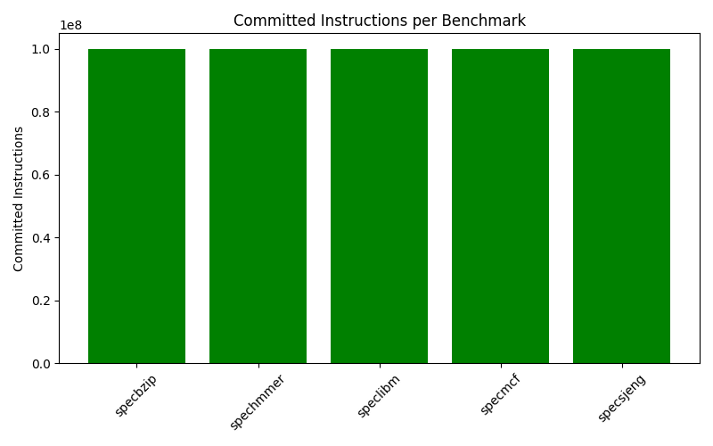

- **CPI** (`system.cpu.cpi`): 

- **L1 D‑cache overall miss rate** (`system.cpu.dcache.overall_miss_rate::total`): 

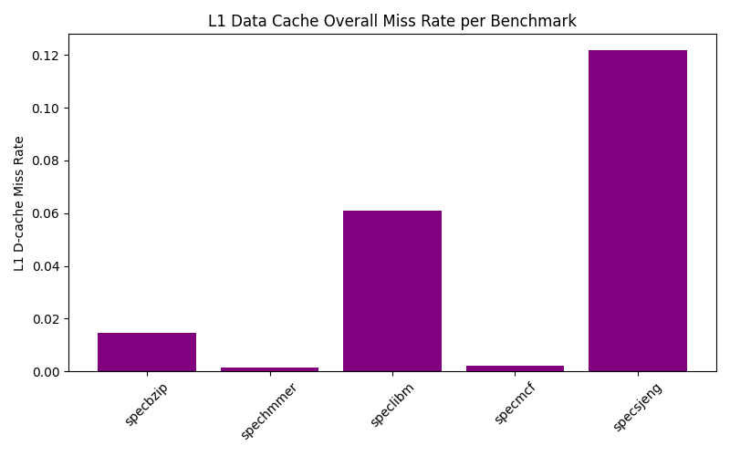

- **L1 I‑cache overall miss rate** (`system.cpu.icache.overall_miss_rate::total`): 

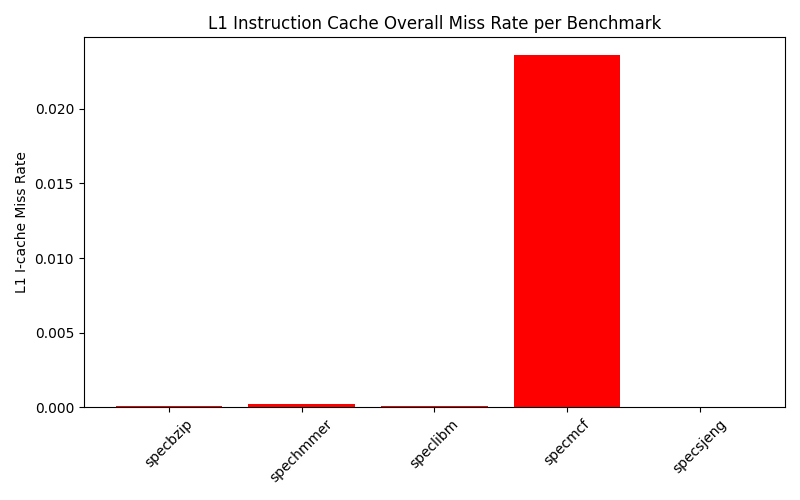

- **L2 cache overall miss rate** (`system.l2.overall_miss_rate::total`): 

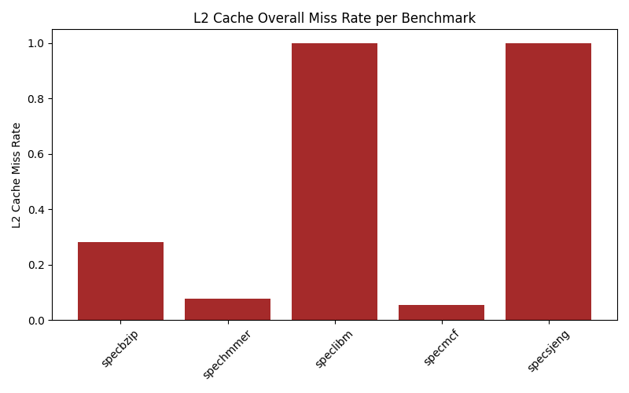

- **Simulated time** (`sim_seconds`): 

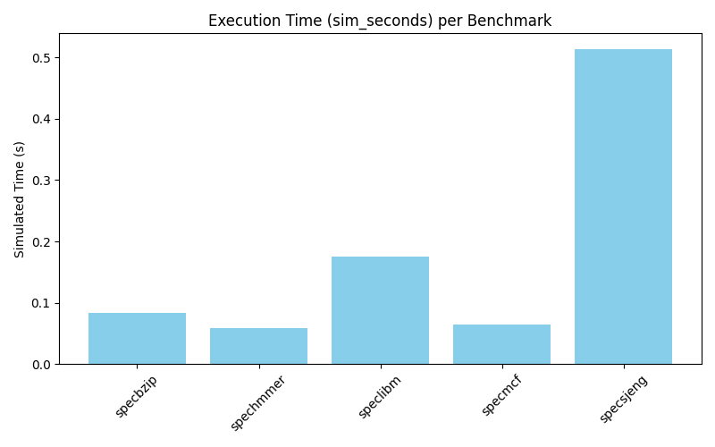

Because the simulations were run with the `-I 100000000` flag, all benchmarks were stopped after **100M committed instructions**. The equal bars in the first plot therefore confirm that every benchmark executed the same instruction budget; differences in performance come from how efficiently each benchmark uses the pipeline and memory system.

- **401.bzip2 (specbzip)** – BZIP2 shows relatively low CPI and low L1D/L2 miss rates, so for the same 100M instructions it finishes quickly. These results show that compression algorithms have decent spatial locality, and the pipeline is rarely stalled, making this benchmark one of the most efficient integer workloads in this set.

- **429.mcf (specmcf)** – MCF has a CPI similar to bzip2 but a noticeable L1I miss rate, reflecting a larger and more complex code footprint. However, its L1D and L2 miss rates remain low, so most data accesses are served from the caches and the overall execution time stays close to bzip2.

- **456.hmmer (spechmmer)** – HMMER achieves the lowest CPI among all benchmarks, along with very low miss rates at every cache level. Its dynamic-programming algorithm has decent spatial locality, so the CPU spends most cycles doing useful work instead of waiting for data from lower levels in the memory hierarchy, making it the fastest benchmark under the fixed 100M-instruction limit.

- **470.lbm (speclibm)** – LBM has a much higher CPI and medium L1D miss rate, while its L2 miss rate is close to 1.0. This indicates a bandwidth‑intensive workload that frequently goes to main memory; the long‑latency memory accesses combined with expensive floating‑point operations explain its significantly higher CPI and longer simulated time.

- **458.sjeng (specsjeng)** – SJENG exhibits the highest CPI and the worst L1D and L2 miss rates, while its I-cache behavior is good. As a chess engine with irregular data structures (trees) and deep, branch-heavy searches, it generates many cache misses, and the branch prediction may not be beneficial. Consequently, the pipeline is often waiting for data, and SJENG has by far the largest simulated time among the five benchmarks.

### Question 3

From the `stats.txt` files of the three runs (1 GHz, 2 GHz, 4 GHz) we observe the following values for the two clock domains:

- `--cpu-clock=1GHz`
  - [system.clk_domain.clock](./spec/cpu-clock-1GHz/specbzip/stats.txt#L289) = 1000 ps
  - [system.cpu_clk_domain.clock](./spec/cpu-clock-1GHz/specbzip/stats.txt#L758) = 1000 ps

- `--cpu-clock=2GHz`
  - [system.clk_domain.clock](./spec/cpu-clock-2GHz/specbzip/stats.txt#L289) = 1000 ps
  - [system.cpu_clk_domain.clock](./spec/cpu-clock-2GHz/specbzip/stats.txt#L758) = 500 ps

- `--cpu-clock=4GHz`
  - [system.clk_domain.clock](./spec/cpu-clock-4GHz/specbzip/stats.txt#L289) = 1000 ps
  - [system.cpu_clk_domain.clock](./spec/cpu-clock-4GHz/specbzip/stats.txt#L758) = 250 ps

We observe that the `--cpu-clock` flag only changes the **CPU clock domain** (`system.cpu_clk_domain.clock`) and leaves the **system clock domain** (`system.clk_domain.clock`) fixed at 1 GHz.

In the corresponding `config.json` files, all CPU‑side components (the cores, the L1 instruction and data caches, the L2 cache, and the TLB walkers and their ports) are connected to `system.cpu_clk_domain`, while uncore components such as the main system bus (membus) are connected to `system.clk_domain`.

This separation of clock domains is intentional and reflects a more realistic SoC‑style organization. By wiring the components this way, gem5 allows us to increase the CPU frequency (1 GHz → 2 GHz → 4 GHz) while keeping the rest of the system at 1 GHz, so we can study how a faster core behaves on top of an unmodified memory/uncore subsystem and observe that performance does not scale perfectly when the bottleneck moves to the 1 GHz interconnect and DRAM.

If we were to add an extra core using the same configuration script, the new core would also be attached to `system.cpu_clk_domain`. This means it would automatically run at the same frequency as the existing core, so all cores in the CPU cluster share the same CPU clock domain, while the uncore components remain at the fixed 1 GHz system clock.

By plotting the simulated time (`sim_seconds`) of each benchmark for 1 GHz, 2 GHz and 4 GHz, we see that there is **no perfect scaling** with the CPU frequency. Doubling or quadrupling `--cpu-clock` does not divide the execution time by 2 or 4. This behaviour is consistent with the clock‑domain organization described above: only the CPU complex speeds up, while the uncore and memory system remain at 1 GHz and the DRAM latencies are defined in absolute time. As the core runs faster, it issues memory requests more aggressively, but the 1 GHz interconnect and DRAM cannot respond proportionally faster, so a growing fraction of CPU cycles are spent stalled waiting for data. Consequently, the benchmarks become increasingly memory‑bound at higher CPU frequencies, and the measured `sim_seconds` improve sub‑linearly instead of showing ideal 1/f scaling.

### Question 4

For this experiment we reran the `458.sjeng` benchmark in gem5 with the same 2 GHz CPU clock, but changed the memory from `DDR3_1600_8x8` to a faster `DDR3_2133_8x8` configuration. This specific benchmark was selected because it had an `l2.overall_miss_rate` equal to 1, meaning it frequently accesses main memory to retrieve data.

- For `DDR3_1600_8x8`:
  - [sim_seconds](./spec/cpu-clock-2GHz/specsjeng/stats.txt#L12) = 0.513528
  - [system.cpu.cpi](./spec/cpu-clock-2GHz/specsjeng/stats.txt#L29) = 10.270554
  - [system.cpu.numCycles](./spec/cpu-clock-2GHz/specsjeng/stats.txt#L155) = 1,027,055,373
  - [system.cpu.idleCycles](./spec/cpu-clock-2GHz/specsjeng/stats.txt#L95) = 805,850,271

- For `DDR3_2133_8x8`:
  - [sim_seconds](./spec/mem-type-DDR3_2133_8x8/specsjeng/stats.txt#L12) = 0.493128
  - [system.cpu.cpi](./spec/mem-type-DDR3_2133_8x8/specsjeng/stats.txt#L29) = 9.862562
  - [system.cpu.numCycles](./spec/mem-type-DDR3_2133_8x8/specsjeng/stats.txt#L155) = 986,256,235
  - [system.cpu.idleCycles](./spec/mem-type-DDR3_2133_8x8/specsjeng/stats.txt#L95) = 765,051,001

As we can observe, there is a small improvement in performance: with the faster memory, the program finishes 3–4% faster and requires fewer cycles to execute the same 100 million instructions. Moreover, the number of idle cycles is also reduced, since DRAM responds more quickly and the CPU spends less time waiting. However, the overall improvement is not significant because the bus connecting the CPU to the DRAM operates at 1 GHz, which becomes the bottleneck in this case.

## Step 2 - Design Exploration and Performance Optimization

### Question 1

The total space of possible cache configurations was extremely large. To make the exploration tractable and meaningful, we applied the following general constraints, based on both architectural best practices and the results from the first step of the assignment:

- **L1 Cache Size Constraint**: The sum of L1 instruction and data cache sizes was limited to ≤ 256 kB.
- **L2 Cache Size Constraint**: L2 cache size was limited to ≤ 4 MB.
- **Associativity Limits**: L1 associativity was not set higher than 4, and L2 associativity was not set higher than 16, since higher associativity increases access latency and complexity.
- **Power-of-Two Values:** All cache sizes and associativities were chosen as powers of two, which is standard in hardware design for efficient indexing and implementation.
- **Base Configuration**: The baseline configuration was 32kB/2-way L1I, 64kB/2-way L1D, 2MB/8-way L2, and 64B line size. For each experiment, we varied only one parameter at a time from this baseline, keeping all others fixed, to isolate the effect of each parameter.

#### **specsjeng & speclibm**

These two benchmarks exhibited the worst performance (highest CPI) in the base case. Both had a noticeable L1D overall miss rate (0.12 for sjeng, 0.06 for libm) and an extremely high L2 overall miss rate (equal to 1), while their L1I miss rates were very low. Based on these result, we tested the following values for each parameter:

- **L1I size and associativity were not varied**, as instruction cache was not a bottleneck.
- **L1D size**: 16, 32, 64, 128 kB
- **L1D associativity**: 1, 2, 4
- **L2 size**: 1, 2, 4 MB
- **L2 associativity**: 4, 8, 16 
- **Cache line size**:
  - **specsjeng**: Since sjeng works with tree structures and pointers, it is less likely to benefit from spatial locality. Therefore, we tested smaller cache line sizes than the baseline: 16, 32, 64, 128 B.
  - **speclibm**: libm operates on a 3D grid and may benefit from spatial locality. Thus, we tested larger cache line sizes: 32, 64, 128 B.

#### **specbzip**

At the base configuration, specbzip exhibited a negligible L1I miss rate, a small L1D miss rate (0.017), and a moderate L2 miss rate (0.3). Based on these results:

- We skipped checking associativities (both L1 and L2), as the benchmark was not particularly prone to conflict misses.
- We focused on L1D size, L2 size, and cache line size to determine whether performance could benefit from a larger cache, or if a smaller cache would suffice.

The values tested were:

- **L1D size**: 16, 32, 64, 128 kB
- **L2 size**: 1, 2, 4 MB
- **Cache line size**: 32, 64, 128 B

#### **specmcf**

For the base configuration, specmcf exhibited very low L1D and L2 miss rates, but had an unexpectedly higher L1I miss rate (0.025) compared to the other benchmarks. Based on this observation:

- We kept the **L1D size and associativity**, **L2 size and associativity**, and **cache line size** fixed at their baseline values, since data and L2 caches were not bottlenecks.
- We focused our exploration on **L1I cache parameters** to investigate whether increasing the instruction cache size or associativity could reduce the L1I miss rate and improve performance.

The values tested were:

- **L1I size**: 16, 32, 64, 128 kB
- **L1I associativity**: 1, 2, 4

#### **spechmmer**

spechmmer demonstrated excellent overall performance at the base configuration, with low miss rates across the entire cache hierarchy and a CPI close to the ideal value of 1 cycle per instruction. Given this strong baseline performance:

- We did not explore **associativity** or **cache line size**, as there was no indication of conflict or spatial locality issues.
- We focused on testing whether spechmmer could maintain its high performance with **smaller L1 and L2 cache sizes**, potentially reducing cost and power without sacrificing efficiency.

The values tested were:

- **L1I size**: 16, 32, 64 kB
- **L1D size**: 16, 32, 64, 128 kB
- **L2 size**: 1, 2, 4 MB

### Question 2

In this section, we present the results of our design exploration to optimize system performance. For each benchmark, we have generated graphs illustrating the impact of the tested parameters on the CPI. Below, we provide a analysis of these results for each benchmark, explaining the observed behaviors and commenting on instances where increasing cache resources yielded diminishing returns or even degraded performance.

#### **speclibm**

`speclibm` is a floating-point benchmark related to Computational Fluid Dynamics (CFD) simulations, characterized by a high CPI and an extremely high L2 miss rate in the baseline configuration. We explored the impact of L1D size, L1D associativity, L2 size, L2 associativity, and cache line size on its performance.

**L1 Data Cache Size:**

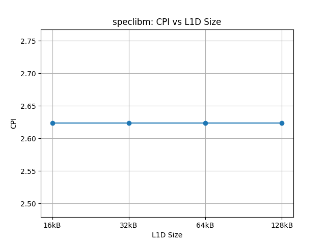

As observed in the plot, varying the L1 data cache size had no impact on the benchmark's CPI. Although a smaller L1D size could potentially reduce hit time, it did not translate into a performance improvement for this specific workload. This suggests that the baseline 64kB size is already sufficient for the L1 working set, and further increases or decreases in L1 data cache size do not provide benefits.

**L1 Data Cache Associativity:**

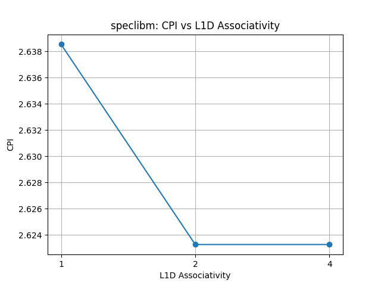

Increasing the associativity to 4 from the baseline of 2 had no noticeable impact on CPI. However, reducing the associativity to 1 (a direct-mapped cache) led to an increase in CPI. While direct-mapped caches can offer lower hit time in memory accesses, they are more prone to conflict misses. In this case, the increase in conflict misses outweighed any benefit from reduced hit latency, negatively impacting performance.

**L2 Cache Size:**

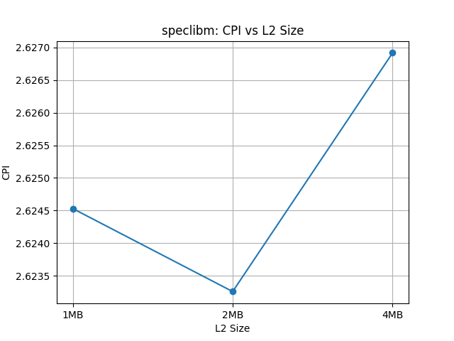

Ιncreasing the L2 cache size resulted in a higher CPI. We initially hypothesized that a larger L2 cache might reduce the extremely high baseline L2 miss rate (near 1.0). However, the results indicate that the working set of `speclibm` is likely too large to fit even in a 4MB L2 cache. Consequently, the larger cache did not solve the miss rate problem but instead increased the L2 hit latency, leading to a higher overall CPI.

**L2 Cache Associativity:**

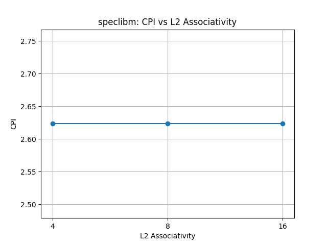

Varying the L2 cache associativity had no impact on the benchmark's CPI, confirming that conflict misses in the L2 cache are not the primary bottleneck for this workload.

**Cache Line Size:**

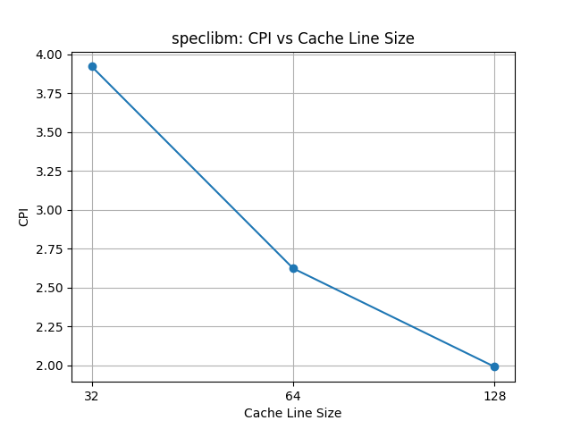

Cache line size significantly influenced performance. As anticipated for a benchmark that operates on large arrays and grids, `speclibm` benefits from spatial locality. Increasing the cache line size allows more data to be fetched on each miss, potentially satisfying future references. Analysis of the `stats.txt` files confirms that larger cache line sizes decreased the overall miss rates in both the L1D and L2 caches. The plot shows that a smaller 32B line size degrades performance, while increasing it from the 64B baseline to 128B provides a modest improvement in CPI.

#### **specsjeng**

`specsjeng` is an integer benchmark (a chess engine) that perhaps uses complex data structures involving trees and pointer chasing. In the baseline configuration, it exhibited the highest CPI and poor miss rates in both L1D and L2 caches. We explored the same parameters as in `speclibm`, to see how they impact `specsjeng`'s performance.

**L1 Data Cache Size:**

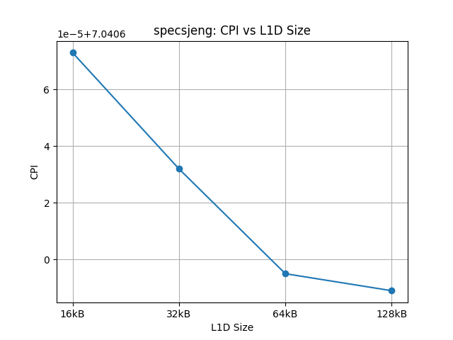

The plot indicates that increasing the L1 data cache size led to improvements in CPI. However, it is important to note the scale of the y-axis; the differences between the tested sizes are extremely small (in the magnitude of $10^{-5}$). While larger sizes are technically better, the baseline 64kB is effectively sufficient, and further increases yield negligible real-world performance gains for this workload.

**L1 Data Cache Associativity:**

The results for L1D associativity mirror those of `speclibm`. Increasing associativity from the baseline of 2 to 4 showed no impact on CPI. Conversely, reducing the cache to direct-mapped (associativity of 1) significantly degraded performance. This confirms that `specsjeng` is susceptible to conflict misses in the L1 data cache, and at least 2-way associativity is necessary to mitigate them.

**L2 Cache Size:**

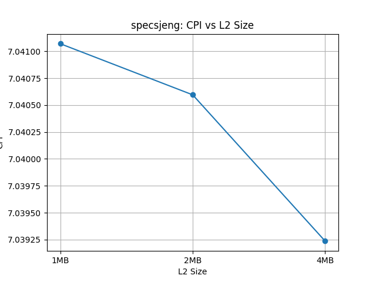

In contrast to `speclibm`, increasing the L2 cache size up to 4MB improved the performance of `specsjeng`, resulting in a lower CPI. We observed from the `stats.txt` file that the overall L2 miss *rate* did not change with the size increase. However, the clear reduction in CPI indicates that the larger cache was nevertheless effective.

**L2 Cache Associativity:**

Increasing L2 associativity resulted in a very slight increase in CPI. These changes are negligible (affecting only the fourth decimal place of the CPI), suggesting that the slight increase in access latency caused by higher associativity outweighed any benefit from reduced conflict misses.

**Cache Line Size:**

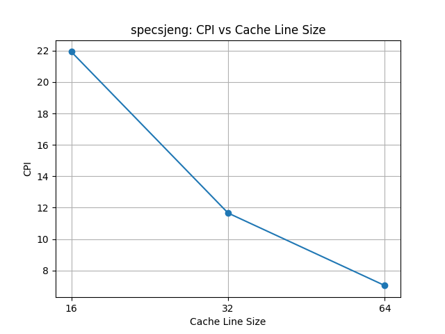

This parameter yielded the most significant and surprising results for this benchmark. We initially hypothesized that `specsjeng` would not benefit from larger cache lines due to its reliance on tree data structures, which typically exhibit poor spatial locality. This hypothesis was proven wrong by the data.

Moving from the baseline 64B line size to 128B dramatically decreased the CPI from approximately 7.5 down to near 5. Analysis of the `stats.txt` files confirmed a significant decrease in the L1 D-cache miss rate with larger lines. This suggests that despite the pointer-based nature of the workload, the tree nodes are likely allocated contiguously in memory, allowing the larger lines to successfully prefetch related data.

#### **specbzip2**

`specbzip2` is an integer benchmark that performs compression. In the baseline configuration, it already exhibited relatively good performance with moderate miss rates, indicating decent locality. We explored the impact of cache sizes and line size to see if further improvements could be gained.

**L1 Data Cache Size:**

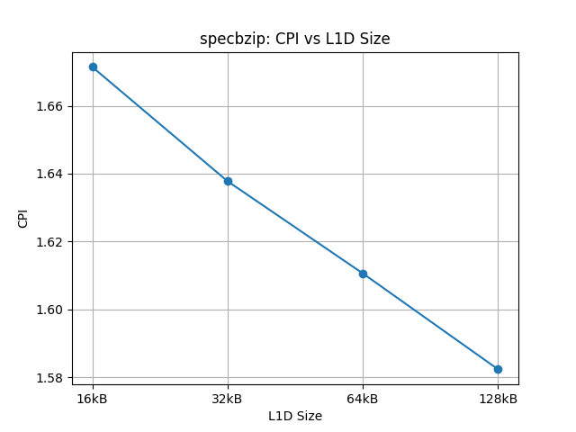

As observed in the plot, increasing the L1 data cache size leads to a decrease in CPI, translating to better performance. Analysis of the `stats.txt` files confirms that larger L1 data cache sizes reduced the overall miss rate for this benchmark. This indicates that the larger capacity effectively reduced capacity misses, positively impacting the overall execution efficiency.

**L2 Cache Size:**

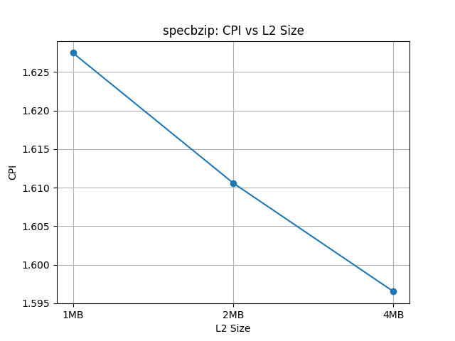

Similar to the L1 data cache results, increasing the L2 cache size also improved the benchmark's performance. The `stats.txt` data shows a decrease in the L2 cache miss rate as the size increases, which directly contributes to the observed reduction in CPI and better overall performance.

**Cache Line Size:**

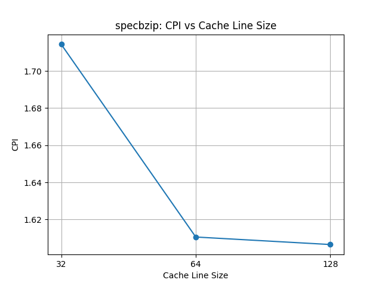

Moving from the baseline 64-byte line size to 128 bytes did not yield a significant improvement in CPI. However, reducing the line size to 32 bytes notably degraded performance. This is logical for `specbzip2`, as compression algorithms typically iterate over large data arrays, exhibiting good spatial locality. A small 32-byte line size fails to fully exploit this locality, requiring more fetches to retrieve the same amount of sequential data compared to larger line sizes.

#### **specmcf**

`specmcf` generally exhibited good performance in the baseline configuration with low L1D and L2 miss rates. However, it stood out due to a notably higher L1 Instruction cache miss rate compared to other benchmarks. Therefore, our exploration focused specifically on optimizing the L1I cache parameters to address this potential bottleneck.

**L1 Instruction Cache Size:**

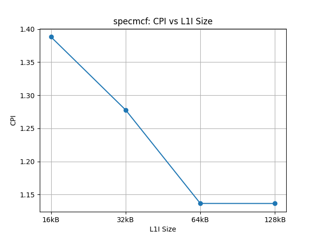

As observed in the plot, increasing the L1I cache size from the baseline 32kB to 64kB significantly decreased the CPI. Analysis of the `stats.txt` files confirms that the instruction cache overall miss rate dropped dramatically from 0.023627 to 0.000018. This substantial reduction in misses means the CPU fetched instructions from lower levels of the memory hierarchy far less frequently, directly leading to the observed performance improvement. However, increasing the size further from 64kB to 128kB had no additional impact on performance, indicating that a 64kB size is sufficient to capture the instruction working set of this benchmark.

**L1 Instruction Cache Associativity:**

This experiment demonstrates that for a relatively small cache size (like the baseline 32kB L1I), higher associativity can be very effective in reducing conflict misses. By increasing the associativity (from the baseline 2-way to 4-way), we observed in the `stats.txt` data that the L1I miss rate dropped almost as effectively as increasing the size, going from 0.023627 down to 0.000019. This reduction in conflict misses led to a clear overall improvement in the benchmark's performance.

#### **spechmmer**

`spechmmer` demonstrated excellent performance in the baseline configuration, with low miss rates across the entire cache hierarchy and a CPI close to ideal. Given this strong starting point, our exploration aimed to determine if increasing cache sizes could provide any further performance benefits.

**L1 Data Cache Size:**

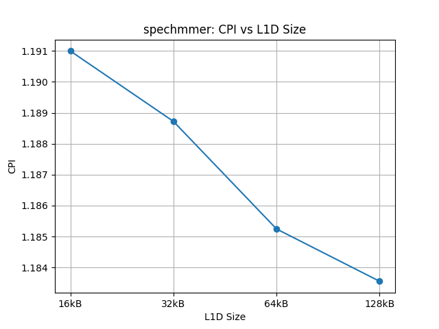

Increasing the L1 data cache size from the baseline 64kB to 128kB managed to reduce the CPI, which is confirmed by a corresponding drop in the overall L1D miss rate as seen in the `stats.txt` files. However, the CPI improvement was extremely small, dropping approximately from 1.185 to 1.184. Doubling the L1 data cache size is probably not worth this very small improvement.

**L1 Instruction Cache Size:**

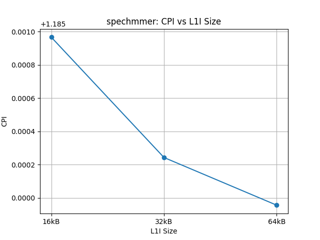

Varying the L1 instruction cache size resulted in changes to the CPI that were only visible in the fourth decimal place. Therefore, the impact of L1I cache size on the performance of this benchmark can be considered negligible.

**L2 Cache Size:**

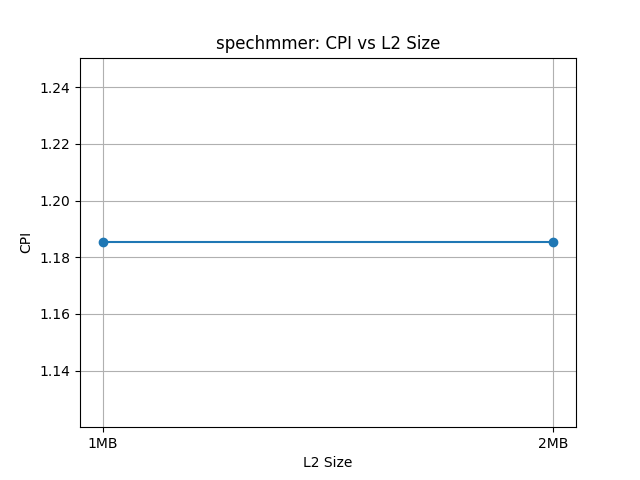

Similar to the instruction cache, changing the L2 cache size had no impact on the performance of `spechmmer`. The working set of this benchmark is evidently small enough to be served efficiently by the baseline cache configuration.

### Step 3 - Cost Function and Cost/Performance Optimization

To evaluate the trade-offs between performance and hardware complexity, we must define a cost function that estimates the "price" of our design choices. Based on digital circuit design principles and literature [1], the primary cost drivers are:

1.  **Cache Capacity (Size):** The cost is roughly proportional to the number of SRAM bits. However, **L1 cache is significantly more expensive per bit than L2**.
    * *Justification:* L1 caches must be extremely fast (low latency) and are often multi-ported to support the pipeline, requiring larger, more complex 6T-SRAM cells compared to the slower SRAM used in L2.
2.  **Associativity:** Higher associativity increases complexity non-linearly.
    * *Justification:* It requires more comparators (tag matching) and wider multiplexers. It also increases power consumption due to parallel tag lookups.
3.  **Cache Line Size:**
    * *Justification:* Larger lines require wider internal buses and buffers, but they reduce the total number of tag bits required for a given cache size (since there are fewer lines). The cost impact of cache line size is generally small.

Based on these factors, we propose the following Cost Function:

$$Cost = w_{L1} \cdot (Size_{L1I} + Siz_{L1D}) + w_{L2} \cdot Size_{L2} + w_{assoc} \cdot (Assoc_{L1I} + Assoc_{L1D}) + w_{assoc} \cdot Assoc_{L2}$$

Where we assign arbitrary cost units as follows:

* **$Size_{L1}$**: Size in KB.
* **$Size_{L2}$**: Size in KB.
* **$Assoc$**: The associativity way-count (e.g., 2, 4, 8).
* **Weights ($w$):**
    * $w_{L1} = 10$: Reflects the cost of the fasterd L1 SRAM.
    * $w_{L2} = 1$: Reflects the cost of the slower L2 SRAM.
    * $w_{assoc} = 50$: A high penalty to discourage high associativity unless absolutely necessary (modeling the complexity of comparators and MUXes).

**The Final Formula:**

$$Cost =10 \cdot (Size_{L1I} + Siz_{L1D}) + 1 \cdot Size_{L2} + 50 \cdot (Assoc_{L1I} + Assoc_{L1D}) + 50 \cdot Assoc_{L2}$$

*(Note: We omit cache line size from the basic cost formula as its impact is secondary compared to the SRAM size and associativity, though it affects the bandwidth requirements).*

We define the optimization metric **Score**, calculated as:

$$Score = \frac{IPC}{Cost} = \frac{1}{CPI \times Cost}$$

We now apply this to the benchmarks to find the optimal configuration that balances speed and hardware cost.

---

**1. speclibm**
* **Performance:** Increasing L1D size/associativity did nothing. Increasing L2 size *hurt* performance. Increasing Line Size to 128B helped.
* **Optimization:**
    * **Optimal Performance Config:** L1=Base, L2=Base, Line=128B.
    * **Cost:** $10(32+64) + 2000 + 50(2+2+8) = 960 + 2000 + 600 = \mathbf{3560}$
    * **Score:** $1 / (1.990451*3560) = 0.00014112323$
* **Conclusion:** Since larger caches provided no benefit (or negative benefit), the **Baseline configuration (with 128B lines)** is the winner. There is no need to pay for extra SRAM that yields no CPI drop.

**2. specsjeng**
* **Performance:** L2 size up to 4MB improved CPI. Line size 128B improved CPI significantly.
* **Trade-off:**
    * **Option A:** L1=Base, L2=Base, Line=128B.
      * **Cost:** $10(32+64) + 2000 + 50(2+2+8) = 960 + 2000 + 600 = \mathbf{3560}$
      * **Score:** $1 / (4.974674*3560) = 0.00005646578$
    * **Option B:** L1=Base, L2_size = 4MB, L2_assoc=Base, Line=128B.
      * **Cost:** $10(32+64) + 4000 + 50(2+2+8) = 960 + 4000 + 600 = \mathbf{5560}$
      * **Score:** $1 / (*5560) = $
* **Conclusion:** The move to 128B lines provides a massive CPI drop (from 7.5 to 5.0) for zero cost. The move to 4MB L2 provides a smaller gain. The **Option A** is the most cost-effective. The Option B is likely too expensive for the marginal gain unless absolute peak performance is required regardless of cost.

**3. specmcf**
* **Performance finding:** L1I size 32kB $\to$ 64kB (or Assoc $\to$ 4) reduced CPI massively.
* **Trade-off:**
    * *Cost of +32KB L1I:* $32 \times 10 = 320$ cost units.
    * *Cost of Assoc 2 $\to$ 4:* $50 \times 1 = 50$ cost units (assuming only L1I changed).
    * *Analysis:* Increasing associativity is cheaper ($50$ units) than doubling the cache size ($320$ units) and achieved nearly the same miss rate reduction (0.000018 vs 0.000019).
    * *Verdict:* **Keep L1I at 32KB but increase Associativity to 4.** This is the "smart" architectural choice—fixing conflict misses with logic (associativity) rather than brute force (size).

**4. specbzip2 & spechmmer**
* **Performance finding:** `specbzip2` scaled with size but is already fast. `spechmmer` saw negligible gains from doubling L1.
* **Verdict:**
    * **spechmmer:** Keep **Baseline**. The cost of doubling L1 ($+640$ units) for a $0.003$ CPI improvement is a terrible return on investment.
    * **specbzip2:** Keep **Baseline**. While CPI improved with L2 size, the benchmark is already efficient. Doubling L2 adds 2048 cost units for a modest gain.

---

### References
[1] Hennessy, J. L., & Patterson, D. A. *Computer Architecture: A Quantitative Approach*.